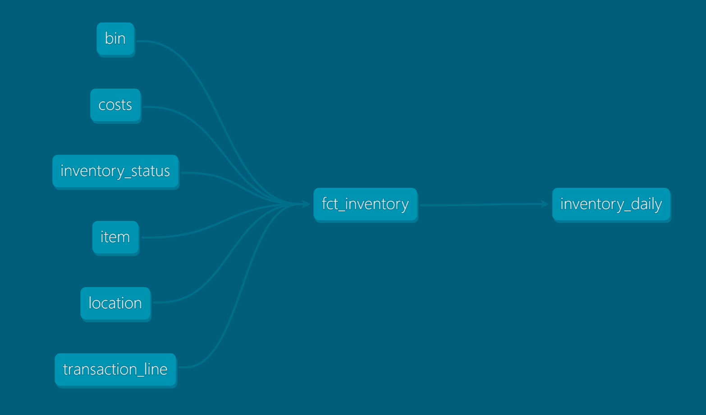

# Analytics Engineer Case Study
Author: Tom Juntunen

#### View my final answers in `deliverable.txt`

#### The data stack used for this case study is as follows:
- duckdb (in-memory OLAP warehouse)
- dbt-core

#### Follow these instructions to run the project:

Pre-requisites:
- Create a Python venv and activate it:
```python -m venv venv``` then ```venv\Scripts\activate``` on Windows or ```venv/bin/activate``` on Linux/Mac.
- Install requirements using pip.
```pip install -r requirements.txt```

1. Add the following to ~/.dbt/profiles.yml
```
and_test:
  target: dev
  outputs:
    dev:
      type: duckdb
      path: 'duckdb/database.duckdb'
```

2. Open a terminal and navigate to the dbt project named **"and_test"**:
```cd and_test```

3. Test your connection:
```dbt debug```

4. Install dbt dependencies: 
```dbt deps```

4. Load the seed data from csv files:
```dbt seed```

5. Run the dbt project to build the models:
```dbt run```

6. Run the database queries to view the results:
```python test_db.py``` 



#### Query the Semantic Layer
1. Using `dbt-core` 

example: ```mf query --metrics cumulative_inventory_quantity --group-by "transaction__transaction_date,transaction__item_id,transaction__location_name,transaction__bin_name,transaction__inventory_status_name" --where "transaction__item_id=209372 and transaction__transaction_date__day='2022-06-05'" --order "-transaction__transaction_date__day"```